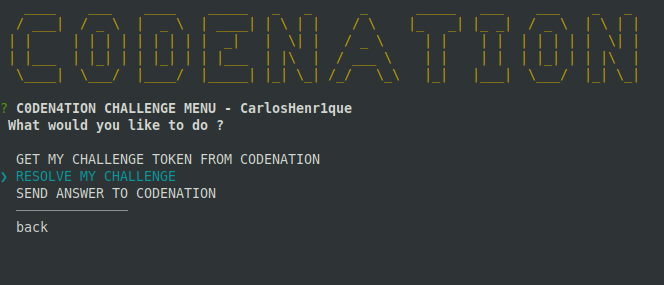

# codenation-challenge
Cryptography of Julius Caesar challenge

<h1 align="center">
    
</h1>

## Installation
You can install the package from npm or yarn.
```bash
yarn or npm install
```

## Usage

```bash
yarn start or npm start

